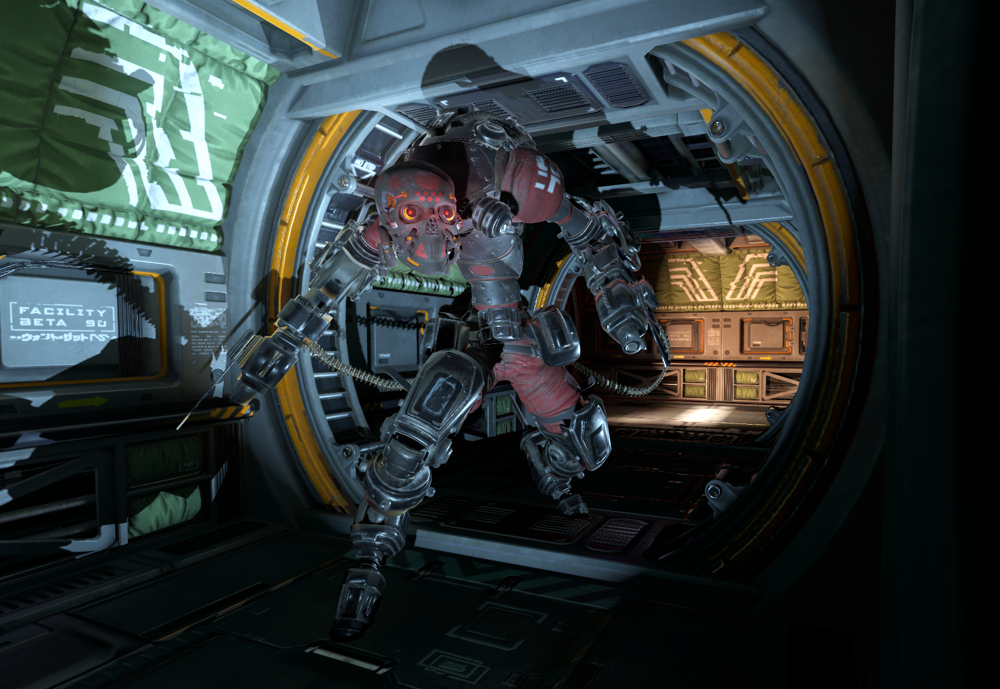
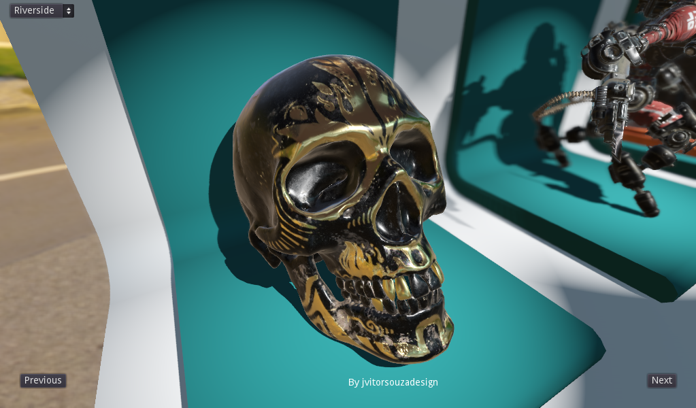
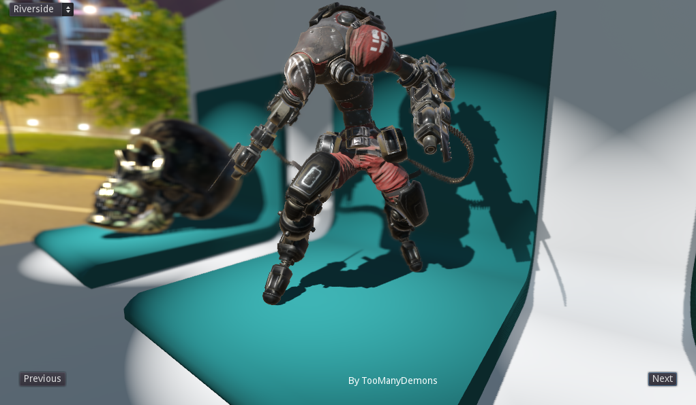
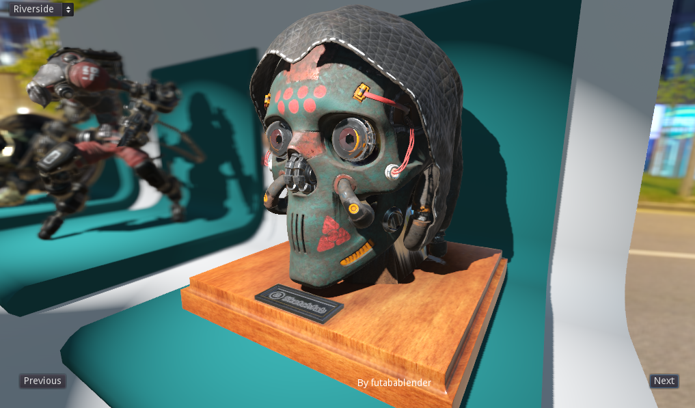

# PBR Showcase

Shows Godot's physically based rendering capabilites.

Language: GDScript

Renderer: GLES 3

## Screenshots

## Credits

| Asset | Source | License |
| ------ | ------ | ------ |
| Material demo | [Repo](https://github.com/godotengine/godot-demo-projects/tree/3.2/3d/material_testers) | MIT |
| Golden Skull | [jvitorsouzadesign](https://sketchfab.com/3d-models/skull-salazar-downloadable-eeed09437afb4e1ea8a6ff3b0e9964ad) | CC BY 4.0  |
| Robot | [TooManyDemons](https://sketchfab.com/3d-models/dreadroamer-b5de35069fd94e6eaf2309a38e6c6a8e) | CC BY 4.0 |
| Skull Trophy | [futaba@blender](https://sketchfab.com/3d-models/skull-trophy-926e3e235de341569f6dcedcded12b90) | CC BY 4.0 |
| Interior | [morepolys](https://sketchfab.com/3d-models/facility-beta-9d-assets-af82b47372064fda844baec238f68d7b) | CC BY 4.0 |
